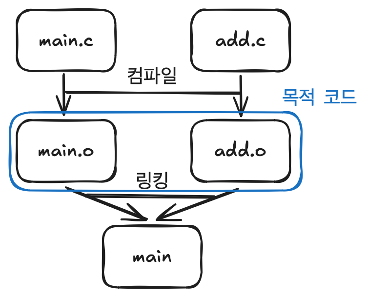

# 18 - 1. 파일 뽀개기 (헤더파일과 #include)

## 모듈화 프로그래밍(파일 나누기)

하나의 코드를 두 코드로 나눌 수 있음.

ex) 정상 작동 함.
```c
// main.c
#include <stdio.h>

// 이 부분을 삭제하면 오류가 생긴다. (컴파일과 링킹)
int add(int a, int b);

int main(){
    int a = 3;
    int b = 5;
    printf("a + b = %d", add(a, b));
    return 0;
}
```

```c
// add.c
int add(int a, int b){
    return a + b;
}
```



컴파일: C 코드를 어셈블리어로 변환

링킹: 다른 파일에 위치한 소스 코드들을 한데 엮어 하나의 실행 파일로 만듬

하지만 계속 함수의 원형을 쓰는 것은 귀찮기 때문에 헤더파일을 이용함.

## 헤더파일(header file)

ex)
```c
// main.c
#include <stdio.h>
#include "add.h"

int main(){
    int a = 3;
    int b = 5;
    printf("a + b = %d", add(a, b));
    return 0;
}
```

```c
// add.c
#include "add.h"
int add(int a, int b){
    return a + b;
}
```

```c
// add.h
int add(int a, int b);
```

### 전처리기(Preprocessor)

`#include`와 같은 명령.

컴파일 이전에 실행됨.

`#include`는 지칭하는 파일의 내용을 정확히 복사해서 붙여 넣음. ex) `#include "add.h"`는 `int add(int a, int b);`로 바뀌는 것.

`<>`로 감싸는 헤더 파일은 컴파일러 기본으로 지원하는 헤더 파일이고 `""`로 감싸는 헤더 파일은 사용자가 직접 제작한 헤더파일이다


